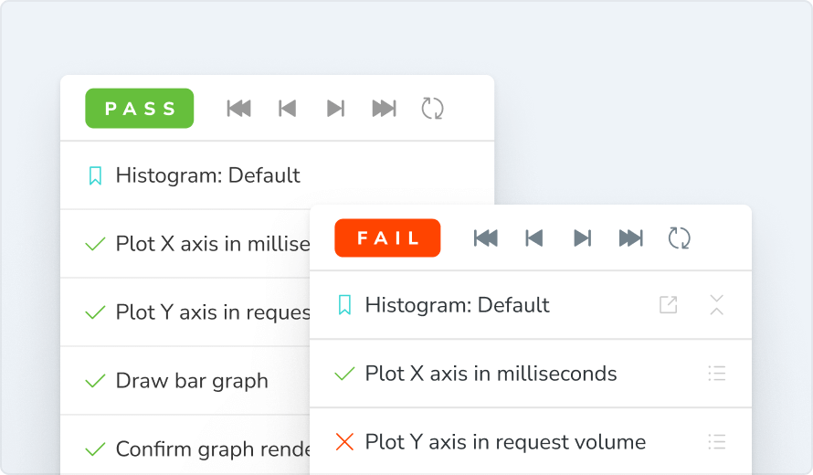
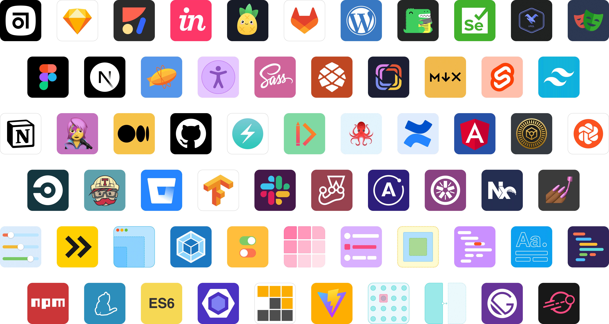

# Configure your project

Because Storybook works separately from your app, you'll need to configure it for your specific stack and setup.
Below, explore guides forconfiguring Storybook with popular frameworks and tools. If you get stuck, learn how you can
ask for help from our community.

## Add styling and CSS

Like with web applications, there are many ways to include CSS within Storybook. Learn more about setting up styling
within Storybook.
https://storybook.js.org/docs/react/configure/styling-and-css

## Provide context and mocking

Often when a story doesn't render, it's because your component is expecting a specific environment or context
(like a theme provider) to be available.
https://storybook.js.org/docs/react/writing-stories/decorators#context-for-mocking

## Load assets and resources

To link static files (like fonts) to your projects and stories, use the `staticDirs` configuration option to specify
folders to load when starting Storybook.
https://storybook.js.org/docs/react/configure/images-and-assets

## Do more with Storybook

Now that you know the basics, let's explore other parts of Storybook that will improve your experience. This list is
just to get you started. You can customise Storybook in many ways to fit your needs.

### Autodocs

Auto-generate living, interactive reference documentation from your components and stories.
https://storybook.js.org/docs/react/writing-docs/autodocs

### Publish to Chromatic

Publish your Storybook to review and collaborate with your entire team.
https://storybook.js.org/docs/react/sharing/publish-storybook#publish-storybook-with-chromatic

### Figma Plugin

Embed your stories into Figma to cross-reference the design and live implementation in one place.
https://storybook.js.org/docs/react/sharing/design-integrations#embed-storybook-in-figma-with-the-plugin

## Testing

Use stories to test a component in all its variations, no matter how complex.
https://storybook.js.org/docs/react/writing-tests/introduction

### Accessibility

Automatically test your components for a11y issues as you develop.
https://storybook.js.org/docs/react/writing-tests/accessibility-testing

### Theming

Theme Storybook's UI to personalize it to your project.
https://storybook.js.org/docs/react/configure/theming

### Addons

Integrate your tools with Storybook to connect workflows.
[Discover all addons](https://storybook.js.org/integrations/)

Join our contributors building the future of UI development.
[Star on GitHub](https://github.com/storybookjs/storybook)

Get support and chat with frontend developers.
[Join Discord server](https://discord.gg/storybook)

Watch tutorials, feature previews and interviews.
[Watch on YouTube](https://www.youtube.com/@chromaticui)

Follow guided walkthroughs for key workflows.
[Discover tutorials](https://storybook.js.org/tutorials/)
